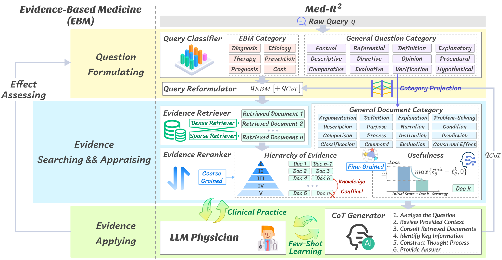
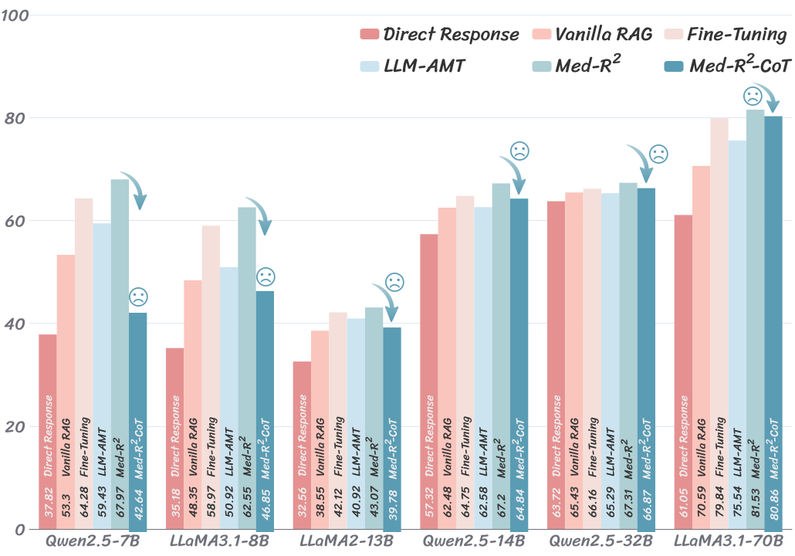
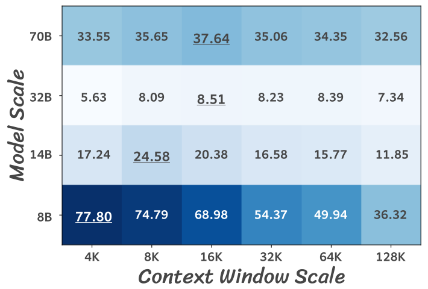

# Med-R<sup>2</sup>: Crafting Trustworthy LLM Physicians through Retrieval and Reasoning of Evidence-Based Medicine
<!-- [](https://opensource.org/licenses/MIT) -->

[](https://arxiv.org/abs/2409.00997)

Python implementation of ***Med-R<sup>2</sup>***, a noval medical LLM framework designed in accordance with the principles of Evidence-Based **Med**icine (EBM), conducting outstanding **R**etrieval and **R**easoning aligned with distinct phases of EBM. 
Comprehensive experiments indicate that **Med-R<sup>2</sup>** achieves a 14.87\% improvement over the vanilla RAG methods, and even a 3.59\% enhancement compared to the fine-tuning strategies without additional training expenses. 
The graphic below provides an overview of **Med-R<sup>2</sup>**.


<!-- ## Getting started -->
## Installation
To get started, please clone the repo and install it:
```bash
pip install -r requirement.txt
```

## Experimental Results 

### Performances Comparing to Baselines



### Analysis Across Scales

