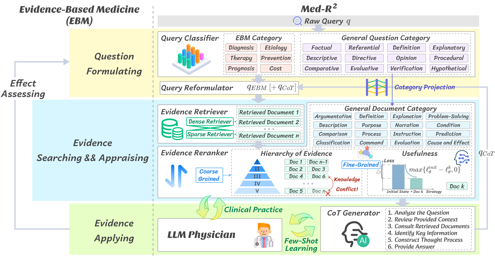
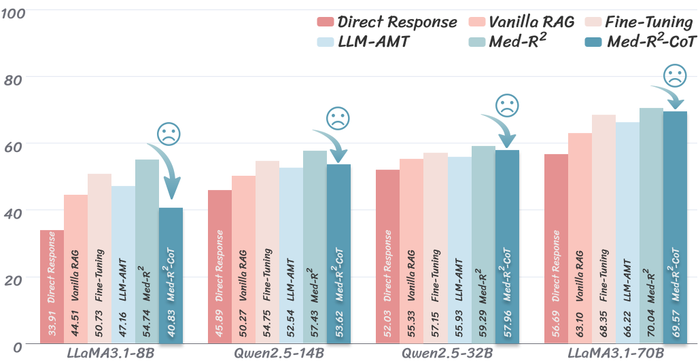
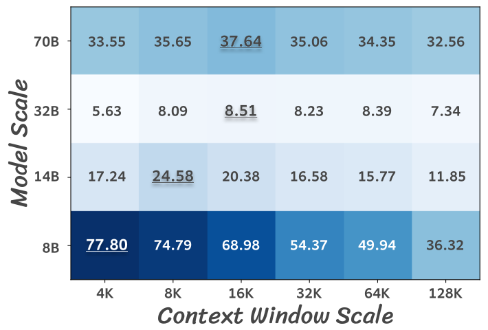

# Med-R<sup>2</sup>: Crafting Trustworthy LLM Physicians through Retrieval and Reasoning of Evidence-Based Medicine
<!-- [](https://opensource.org/licenses/MIT) -->

[](https://arxiv.org/abs/2409.00997)

Python implementation of ***Med-R<sup>2</sup>***, a noval medical LLM framework designed in accordance with the principles of Evidence-Based **Med**icine (EBM), conducting outstanding **R**etrieval and **R**easoning aligned with distinct phases of EBM. 
Comprehensive experiments indicate that **Med-R<sup>2</sup>** achieves a 14.87\% improvement over the vanilla RAG methods, and even a 3.59\% enhancement compared to the fine-tuning strategies without additional training expenses. 
The graphic below provides an overview of **Med-R<sup>2</sup>**. Check out the [paper](https://arxiv.org/pdf/2501.11885) for more details.



## Evaluation and Inference with Med-R<sup>2</sup>
<!-- ## Quick Start -->
<!-- ## Getting started -->
<!-- ## Installation -->

### 1. Datasets

We have selected five medical datasets for evaluation:

- [MedQA-USMLE](https://www.mdpi.com/2076-3417/11/14/6421)
- [MedQA-MCMLE](https://www.mdpi.com/2076-3417/11/14/6421)
- [MedMCQA](https://proceedings.mlr.press/v174/pal22a/pal22a.pdf)
- [PubMedQA](https://arxiv.org/pdf/1909.06146)
- [MMLU-Med](https://arxiv.org/pdf/2009.03300)


### 2. Models

For each benchmark, we employ the following open-source models:

- [Qwen2.5-7B](https://huggingface.co/Qwen/Qwen2.5-7B)
- [LLaMA3.1-8B](https://huggingface.co/meta-llama/Llama-3.1-8B)
- [LLaMA2-13B](https://huggingface.co/meta-llama/Llama-2-13b-hf)
- [Qwen2.5-14B](https://huggingface.co/Qwen/Qwen2.5-14B)
- [Qwen2.5-32B](https://huggingface.co/Qwen/Qwen2.5-32B)
- [LLaMA3.1-70B](https://huggingface.co/meta-llama/Llama-3.1-70B)


### 3. Quick Start
To get started, please clone the repo and install it:
```bash
git clone git@github.com:8023looker/Med-RR.git
pip install -r requirement.txt
```

#### 3.1 Question Formulating

The question formulating stage consists of two components: *query classifier* and *query reformulator*.

**Query Classifier**: The component categorizes the queries based on Evidence-Based Medicine (EBM) categories and general natural language question types. We deploy [Qwen2.5-72B-Instruct](https://huggingface.co/Qwen/Qwen2.5-72B-Instruct) with vLLM on 4 H800 GPUs for categorizaion.

```bash
cd ./RAG/classification/
python qwen_classify.py
```

<!-- --- -->

**Query Reformulator**: The component performs domain-specific reformulations of the original queries based on their respective classes of the EBM categories to align with the professional context.

```bash
cd ./RAG/query_rewriting/
python qwen_rewriting.py
python qwen_rewriting_pubmedqa.py
```

---

#### 3.2 Evidence Searching and Appraising

<!-- We provide an example in ``./RAG/query/output/sample.jsonl`` to demonstrate the *fine-grained reranking* process. -->

The output of the evidence retrieving and coarsely ranking for each query during the **Evidence Searching and Appraising** process is structured according to the format exemplified in ``./RAG/query/output/sample.jsonl``, which facilitates subsequent processing and analysis.

```bash
cd ./RAG/rerank/
```

The *fine-grained reranking* score can be formulated as:

$$\mathcal{F}\left( x\right) = f_h\left( x\right ) \cdot f_g\left( x\right ) \left(1 + \alpha \cdot f_u\left( x\right ) \right)$$ 
 <!-- \quad (\alpha=1) -->

where $\alpha$ is the nonnegative hyper-parameter for weight controlling. Here we treat each factor as having equal importance, hence we set $\alpha=1$.

**(1) Hierarchy of Evidence**

$$f_h\left( x\right ) = 9 - \left( e_x - 1\right)$$

```bash
python evidence_level.py
```

<!-- --- -->

**(2) Usefulness**

<!-- $$f_u(x) = \max \left\{ \ell_\theta^{init} - \ell_\theta^x, 0 \right\}$$ -->
$$
f_u(x) = \max \left\{ \ell_\theta^{\text{init}} - \ell_\theta^x, 0 \right\}
$$

```bash
cd ./usefulness/
bash run_evaluate.sh
```

<!-- --- -->

**(3) General Document Category**

$$f_g\left( x\right ) = \sum_{j=1}^{|C^e|} p(x | c_j)$$

```bash
python general_doc_category.py
```

---

#### 3.3 Evidence Applying

**CoT Generator**: The component constructs a chain-of-thought reasoning process based on the original medical query and the retrieved evidence documents.

```bash
cd ./RAG/CoT/
python qwen_CoT_generation.py
```


## Experimental Results 

### Performances Comparing to Baselines



#### Analysis Across Scales



## Citation 

If this was useful to you, please cite the [paper](https://arxiv.org/pdf/2501.11885):
```
@misc{lu2025medr2craftingtrustworthyllm,
      title={Med-R$^2$: Crafting Trustworthy LLM Physicians through Retrieval and Reasoning of Evidence-Based Medicine}, 
      author={Keer Lu and Zheng Liang and Da Pan and Shusen Zhang and Xin Wu and Weipeng Chen and Zenan Zhou and Guosheng Dong and Bin Cui and Wentao Zhang},
      year={2025},
      eprint={2501.11885},
      archivePrefix={arXiv},
      primaryClass={cs.CL},
      url={https://arxiv.org/abs/2501.11885}, 
}
```